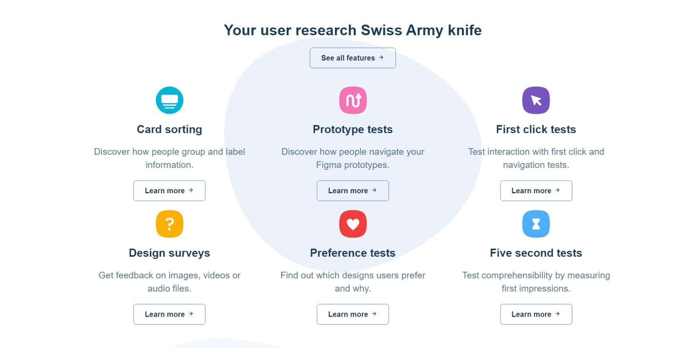
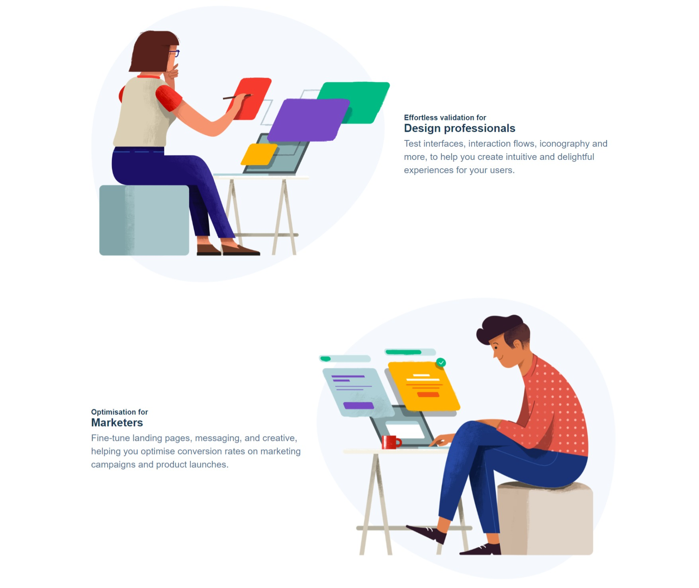
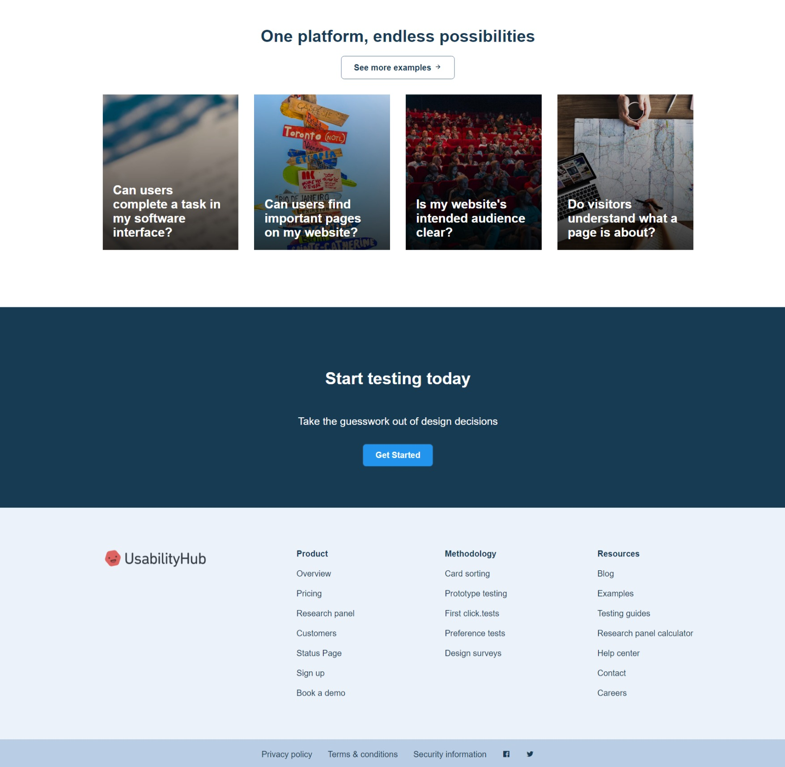

# UsabilityHub Website Clone


## Description

This project is a clone of the UsabilityHub website (https://usabilityhub.com), recreated as a part of my front-end development project. The purpose of this project was to showcase my skills in HTML and CSS, demonstrating my ability to replicate a real-world website design.

## Demo

You can view a live demo of the project [here](https://usabilityhub-website.netlify.app/).

## Technologies Used

- HTML5
- CSS3

## Features

- Replicated the overall layout and design of the original UsabilityHub website.
- Created a responsive design to ensure compatibility across various devices and screen sizes.
- Implemented some interactive elements using CSS animations and transitions.

## Screenshots





## How to Use

1. Clone this repository to your local machine using the following command:

```bash
git clone https://github.com/rahulkumar-yadav/usabilityhub-website-clone.git
```

2. Open the `index.html` file in your web browser to view the website.

<br />

Thank you for checking out my project!
